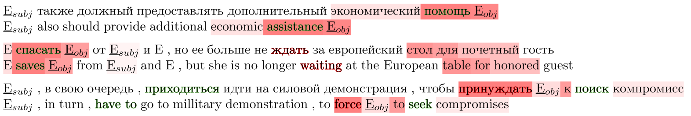

# Studying Attention Models in Sentiment Attitude Extraction Task

> **UPD December 18'th, 2020**: Fixed bug in results evaluation; the latter might affect on prec/recall for documents that lacks of neutral opinions in model results. [[issue #1]](https://github.com/nicolay-r/attitude-extraction-with-attention/issues/1) 

> **UPD May 28'th, 2020:** ~~An additional restriction towards entity pairs considered as an attitude in context. We treat pairs between object and subject appeared in context **only when** the distance between them in words (terms) not greater than 10. [[source code reference]](https://github.com/nicolay-r/attitude-extraction-with-attention/blob/058e779a82a076089e3c961cfab996c62066ee41/experiments/rusentrel/neutrals.py#L180)~~ (this feature [was commented](https://github.com/nicolay-r/attitude-extraction-with-attention/issues/2)) 


> **Figure:** Weight distribution visualization for model Att-BLSTM 
on sentiment contexts, where attitude is conveyed 
by frame (colored), presented in context.

This repository provides a source code of models and related experiments, conducted as a part of the following paper:

* Studying Attention Models in Sentiment Attitude Extraction Task 
[[Springer]](https://doi.org/10.1007/978-3-030-51310-8_15) /
[[arXiv:2006.11605]](https://arxiv.org/abs/2006.11605) /
[[presentaiton]](docs/nldb_2020_slides.pdf)
    * Rusnachenko Nicolay, Loukachevitch Natalia
    * NLDB-2020

## Dependencies

* Python-2.7
* [arekit-0.20.0-nldb-rc](https://github.com/nicolay-r/AREkit/tree/0.20.0-nldb-rc)

## Installation

* **Core library installation:** All the implementation depends on 
core library for *sentiment attitude extraction*, 
dubbed as [**arekit-0.20.0**](https://github.com/nicolay-r/AREkit/blob/0.20.0-nldb-rc/README.md):
> **NOTE:** it is important to download in ``arekit`` directory.
```
# Download arekit-0.20.0
git clone --single-branch --branch 0.20.0-nldb-rc https://github.com/nicolay-r/AREkit arekit

# Install dependencies
pip install -r arekit/dependencies.txt
```
* **Resources**: Since **arekit-0.20.0** all the resources such as collections 
(RuAttitudes, RuSentRel) and lexicons 
(RuSentiLex) are a part o``f the related library.

* **Word2Vec**: installation assumes to run a ``download.sh`` script:
```
cd data && ./download.sh
```

## References

```
@inproceedings{rusnachenko-2020-attention,
    title = "Studying Attention Models in Sentiment Attitude Extraction Task",
    author = "Rusnachenko, Nicolay  and Loukachevitch, Natalia",
    journal = "M\'etais E., Meziane F., Horacek H., Cimiano P. (eds) Natural Language Processing and Information Systems. 
        NLDB 2020. Lecture Notes in Computer Science, vol 12089. Springer, Cham",
    booktitle = "Proceedings of the 25th International Conference on Natural Language and Information Systems",
    year = "2020",
    url = "https://doi.org/10.1007/978-3-030-51310-8_15",
    doi = "10.1007/978-3-030-51310-8_15",
}
```
